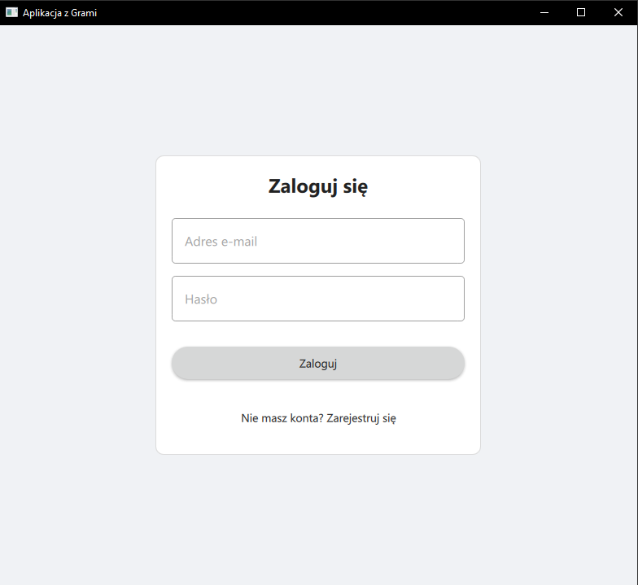
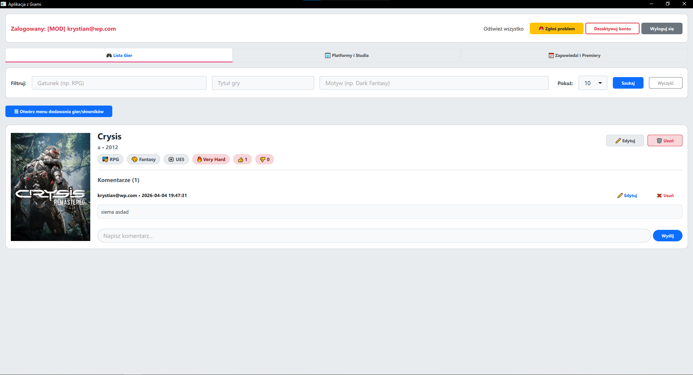
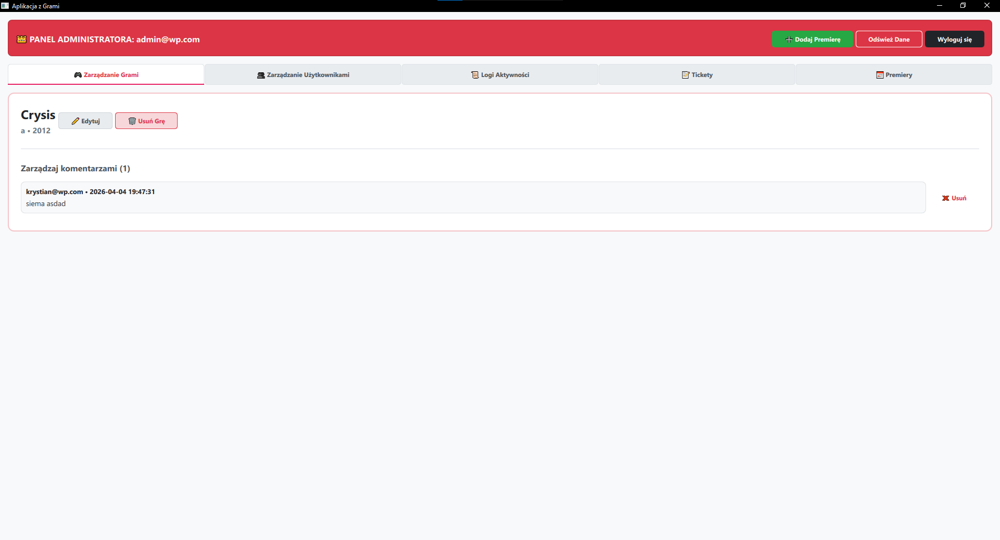
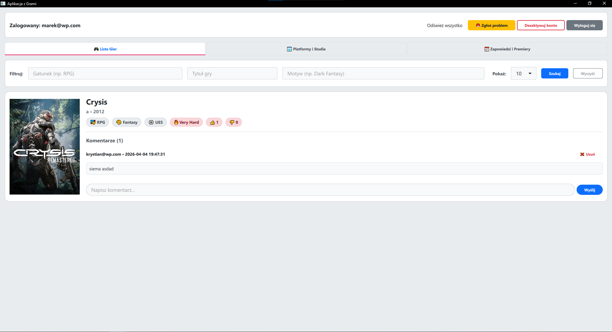

# Game Catalog [Academic Project]

A compact client-server application for managing and rating video games. The project combines a fast C++ backend server with a modern, responsive user interface built in Qt/QML.

## Overview

<p align="center">
  
</p>
<p align="center">
  
</p>
<p align="center">
  
</p>
<p align="center">
  
</p>

## Technologies

* **Backend:** C++ (`cpp-httplib`, `nlohmann/json`), MongoDB (`mongo-cxx-driver`)
* **Frontend:** Qt 6 (QML, native C++ plugins for file uploads)
* **Infrastructure:** Docker & Docker Compose
* **MicroServices**

## Key Features

* **Authentication & Roles:** Separate dashboards for Administrators, regular Users and moderator.
* **Game Database:** Browsing, searching, and filtering games by genre, title and theme.
* **Rating System:** Upvoting and downvoting games, securely protected against multiple votes from the same user.
* **Media:** Support for uploading and displaying cover images (server-side file upload).
* **Comments:** Dedicated discussion sections available under each game.

## How to Run the Project

### 1. Server and Database (Backend)
Ensure you have Docker installed. Navigate to the backend directory and start the containers:

```bash
docker-compose up --build -d
